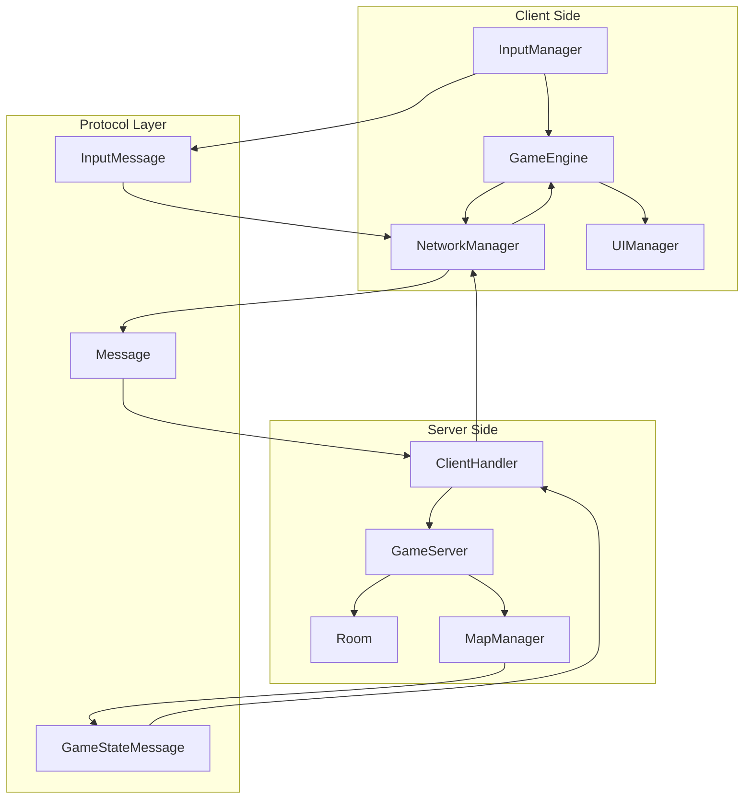
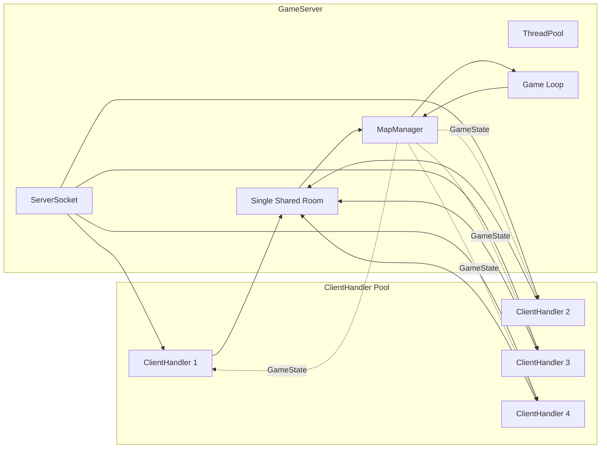
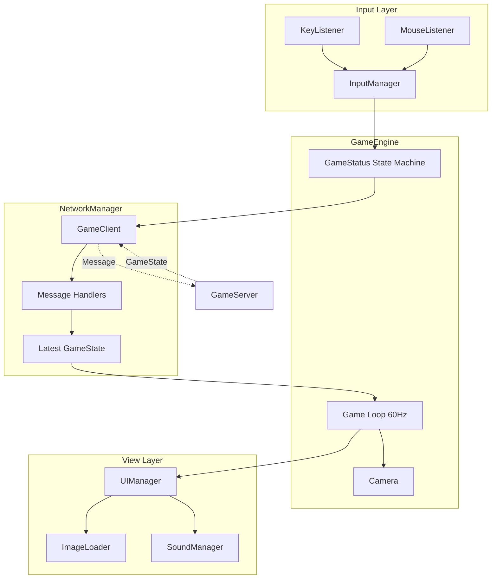
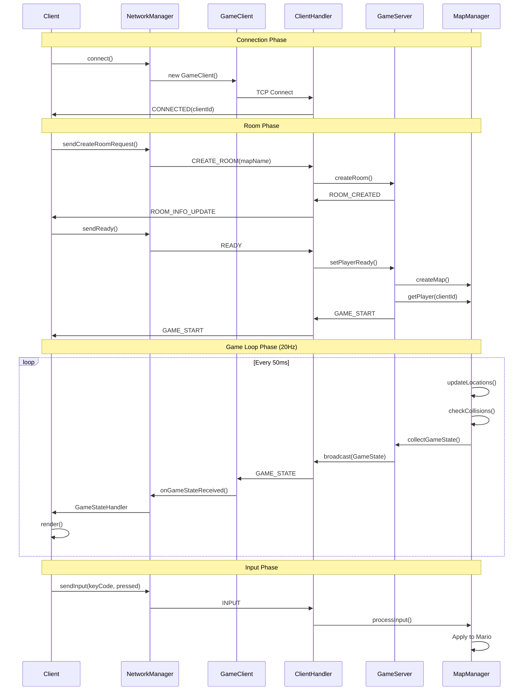
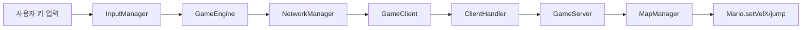
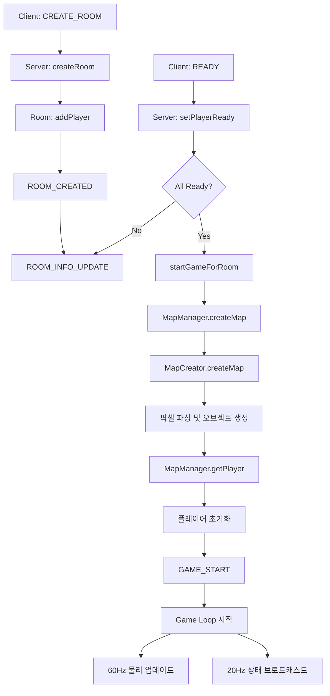
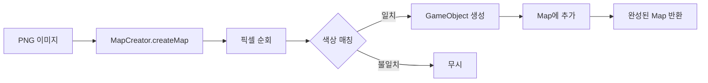
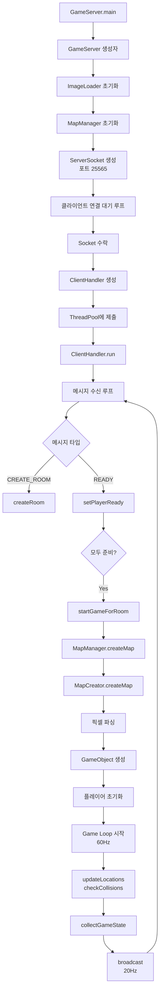
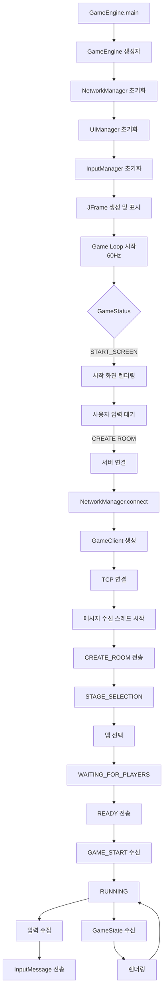

# Super Mario Bros - 멀티플레이어 게임

한성대학교 컴퓨터공학부 3학년 김민상  
네트워크 프로그래밍 - 2025년 2학기

## 개요

본 프로젝트는 Java Swing 기반의 멀티플레이어 슈퍼 마리오 게임이다. 서버-클라이언트 아키텍처를 채택하여 권한 서버가 모든 게임 로직을 처리하고, 클라이언트는 입력 수집 및 렌더링만 담당하는 구조로 설계되었다.

## 시스템 아키텍처

### 전체 구조



### 서버 아키텍처

서버는 다중 클라이언트 연결을 관리하고 모든 게임 로직을 실행한다.



#### 주요 서버 컴포넌트

**GameServer**
- 포트 25565에서 TCP 연결 수락
- ClientHandler 스레드 풀 관리
- 단일 공유 Room 관리 (최대 4인)
- 60Hz 게임 로직 업데이트
- 20Hz GameState 브로드캐스트
- 1Hz 타이머 갱신

**ClientHandler**
- 클라이언트별 독립 스레드
- 메시지 수신 및 프로토콜 처리
- 동기화된 메시지 송신
- 연결 종료 시 리소스 정리

**Room**
- 플레이어 대기 및 관리
- 준비 상태 추적
- 방장 자동 지정 및 재할당
- 게임 시작 조건 검증

**MapManager (서버)**
- 맵 생성 및 초기화
- 물리 시뮬레이션 (중력, 속도)
- 충돌 감지 및 처리
- 플레이어 배열 관리 (players[1~4])
- 게임 상태 직렬화 (GameStateMessage)

### 클라이언트 아키텍처

클라이언트는 사용자 입력을 서버로 전송하고 서버 상태를 렌더링한다.



#### 주요 클라이언트 컴포넌트

**GameEngine**
- 클라이언트 메인 루프 (60Hz)
- GameStatus 상태 기계 관리
  - START_SCREEN: 메인 메뉴
  - STAGE_SELECTION: 맵 선택
  - CONNECTING: 서버 연결 중
  - WAITING_FOR_PLAYERS: 대기실
  - RUNNING: 게임 진행
  - GAME_OVER: 게임 종료
- 카메라 추적 (내 플레이어 기준)
- NetworkManager 통합

**NetworkManager**
- GameClient 래핑 및 추상화
- 콜백 핸들러 등록
  - GameStateHandler
  - RoomInfoHandler
  - GameStartHandler
- 입력 메시지 전송
- 최신 게임 상태 캐싱

**GameClient**
- TCP 소켓 연결 (localhost:25565)
- ObjectInputStream/ObjectOutputStream
- 별도 스레드에서 메시지 수신
- 타입별 메시지 라우팅

**UIManager**
- 더블 버퍼링 기반 렌더링
- GameStatus별 화면 전환
- GameStateMessage 기반 렌더링
  - 플레이어 (마리오 폼, 애니메이션)
  - 적 (굼바, 쿠파)
  - 블록 (OrdinaryBrick, SurpriseBrick, GroundBrick, Pipe)
  - 아이템 (코인, 버섯, 파이어 플라워)
  - 파이어볼
- HUD 표시 (점수, 생명, 코인, 시간)
- 리더보드 표시 (우측 상단)

**InputManager**
- KeyListener: 키보드 입력 캐싱
- MouseListener: 메뉴 선택
- 게임 중 입력을 InputMessage로 변환
- NetworkManager를 통해 서버로 전송

### 네트워크 프로토콜



#### 메시지 타입

**클라이언트 → 서버**
- `CONNECT`: 초기 연결 요청
- `CREATE_ROOM`: 방 생성 (맵 이름 포함)
- `JOIN_ROOM`: 방 참가
- `READY`: 준비 완료
- `INPUT`: 키보드 입력 (keyCode, pressed)
- `DISCONNECT`: 연결 종료

**서버 → 클라이언트**
- `CONNECTED`: 연결 승인 (할당된 clientId)
- `ROOM_CREATED`: 방 생성 완료
- `ROOM_INFO_UPDATE`: 방 정보 (인원수, 방장)
- `GAME_START`: 게임 시작 신호
- `GAME_STATE`: 전체 게임 상태 (20Hz)

#### GameStateMessage 구조

서버가 20Hz로 브로드캐스트하는 게임 상태 전체 스냅샷이다.

```java
class GameStateMessage {
    PlayerState[] players;      // players[0]=null, players[1~4]=플레이어
    EnemyState[] enemies;       // 모든 적 상태
    ItemState[] items;          // 모든 아이템 상태
    FireballState[] fireballs;  // 모든 파이어볼 상태
    BrickState[] bricks;        // 모든 블록 상태
    GameInfo gameInfo;          // 시간, 카메라, 맵 이름
}

class PlayerState {
    int x, y;                   // 위치
    int velX, velY;             // 속도
    boolean jumping;            // 점프 중
    boolean toRight;            // 방향
    int lives;                  // 남은 생명
    int coins;                  // 코인 수
    int points;                 // 점수
    String form;                // 마리오 폼 (SMALL, SUPER, FIRE)
    boolean damageInvincible;   // 피격 무적 상태
}
```

### 데이터 흐름

#### 입력 → 게임 로직 흐름



#### 게임 상태 → 렌더링 흐름

```mermaid
graph LR
    A[MapManager.collectGameState] --> B[GameStateMessage]
    B --> C[GameServer.broadcast]
    C --> D[ClientHandler.sendMessage]
    D --> E[GameClient.handleMessage]
    E --> F[NetworkManager.onGameStateReceived]
    F --> G[GameEngine.latestGameState]
    G --> H[UIManager.drawGameFromState]
    H --> I[화면 렌더링]
```



#### 방 생성 및 게임 시작 흐름



### 역할 분담

#### 서버 역할 (Authority Server)

1. **게임 로직 실행**
   - 플레이어 이동 및 점프
   - 중력 및 속도 계산
   - 충돌 감지 (플레이어-블록, 플레이어-적, 파이어볼-적)
   - 아이템 효과 적용
   - 점수 및 생명 관리

2. **상태 관리**
   - 모든 게임 오브젝트 상태 보유
   - 플레이어 배열 관리 (players[1~4])
   - 적, 아이템, 블록, 파이어볼 목록 관리

3. **네트워크 관리**
   - 클라이언트 연결 수락
   - Room 기반 플레이어 대기 및 준비 상태
   - 20Hz GameState 브로드캐스트
   - 입력 메시지 수신 및 적용

4. **타이밍 제어**
   - 60Hz 게임 루프
   - 20Hz 동기화
   - 1Hz 시간 갱신

#### 클라이언트 역할 (Dumb Terminal)

1. **입력 수집**
   - 키보드 입력 캐싱 (좌, 우, 점프, 파이어)
   - InputMessage로 변환 및 전송
   - 마우스 입력 (메뉴 선택)

2. **렌더링**
   - GameStateMessage 기반 순수 렌더링
   - 플레이어, 적, 아이템, 블록, 파이어볼 그리기
   - 애니메이션 프레임 선택
   - HUD 표시
   - 리더보드 표시

3. **UI 관리**
   - 메인 메뉴, 맵 선택, 대기실 화면
   - GameStatus 상태 기계
   - 사운드 재생

4. **카메라 제어**
   - 자신의 플레이어 추적
   - 화면 스크롤

## 맵 제작

맵은 PNG 이미지로 제작되며, 각 픽셀의 RGB 값이 특정 게임 오브젝트로 변환된다.

### 픽셀 색상 코드

**기본 오브젝트**
- `RGB(160, 160, 160)`: 마리오 시작 위치
- `RGB(0, 0, 255)`: 일반 벽돌 (OrdinaryBrick)
- `RGB(255, 0, 0)`: 지면 (GroundBrick) - Map 1
- `RGB(127, 51, 0)`: 지면 (GroundBrick) - Map 2
- `RGB(0, 255, 0)`: 파이프 (Pipe)
- `RGB(0, 255, 255)`: 굼바 (Goomba)
- `RGB(255, 0, 255)`: 쿠파 (KoopaTroopa)
- `RGB(160, 0, 160)`: 깃발 (EndFlag)

**물음표 블록**
- `RGB(255, 255, 0)`: 랜덤 아이템
- `RGB(255, 200, 0)`: 코인
- `RGB(255, 100, 0)`: 슈퍼 버섯
- `RGB(255, 150, 0)`: 파이어 플라워
- `RGB(200, 255, 0)`: 1UP 버섯

**숨겨진 블록**
- `RGB(0, 0, 254)`: 숨겨진 코인 블록 (일반 블록처럼 보임)

**배경**
- `RGB(0, 0, 0)`: 빈 공간 (투명)

### 맵별 렌더링 규칙

**Map 1 (지상)**
- 배경: 하늘색 + 구름 이미지
- GroundBrick (빨간색): 원래 스프라이트
- GroundBrick (갈색): 렌더링 안 함 (투명)

**Map 2 (지하)**
- 배경: 검은색 단색
- GroundBrick (갈색): OrdinaryBrick 스프라이트로 렌더링

### 맵 생성 과정



## 주요 기능

### 멀티플레이어

- 최대 4인 동시 플레이
- 단일 공유 방 시스템
- 방장 자동 할당 및 재할당
- 준비 시스템 (모두 준비 시 자동 시작)
- 플레이어별 독립 카메라

### 게임 메커니즘

- 3단계 마리오 폼 (SMALL → SUPER → FIRE)
- 피격 무적 시간 (2초)
- 코인 100개 수집 시 1UP
- 시간 제한 (400초)
- 점프 높이 조절 (키 홀드 시간)
- 파이어볼 발사 (Fire Mario)

### 블록 상호작용

- OrdinaryBrick: 아래에서 충돌 시 파괴
- SurpriseBrick: 아이템 생성 후 빈 블록
- GroundBrick: 파괴 불가
- Pipe: 파괴 불가, 장애물

### 적 처리

- 위에서 밟기: 점수 획득, 적 제거
- 옆에서 충돌: 마리오 폼 다운그레이드 또는 생명 감소
- 파이어볼 타격: 적 제거

## 프로젝트 구조

```
src/
├── manager/
│   ├── ButtonAction.java       # 버튼 액션 정의
│   ├── Camera.java              # 카메라 위치 관리
│   ├── GameEngine.java          # 클라이언트 메인 엔진
│   ├── GameStatus.java          # 게임 상태 열거형
│   ├── InputManager.java        # 입력 수집 및 전송
│   ├── MapCreator.java          # PNG 파싱 및 맵 생성
│   ├── MapManager.java          # 서버 게임 로직
│   └── SoundManager.java        # 사운드 재생
│
├── model/
│   ├── brick/
│   │   ├── Brick.java           # 블록 기본 클래스
│   │   ├── GroundBrick.java     # 지면 블록
│   │   ├── OrdinaryBrick.java   # 일반 벽돌
│   │   ├── Pipe.java            # 파이프
│   │   └── SurpriseBrick.java   # 물음표 블록
│   ├── enemy/
│   │   ├── Enemy.java           # 적 기본 클래스
│   │   ├── Goomba.java          # 굼바
│   │   └── KoopaTroopa.java     # 쿠파
│   ├── hero/
│   │   ├── Fireball.java        # 파이어볼
│   │   ├── Mario.java           # 마리오 (물리, 상태)
│   │   └── MarioForm.java       # 마리오 폼 열거형
│   ├── prize/
│   │   ├── BoostItem.java       # 부스트 아이템 기본 클래스
│   │   ├── Coin.java            # 코인
│   │   ├── FireFlower.java      # 파이어 플라워
│   │   ├── OneUpMushroom.java   # 1UP 버섯
│   │   ├── Prize.java           # 프라이즈 기본 클래스
│   │   └── SuperMushroom.java   # 슈퍼 버섯
│   ├── EndFlag.java             # 깃발
│   ├── GameObject.java          # 모든 오브젝트 기본 클래스
│   ├── GameRecord.java          # 게임 기록
│   └── Map.java                 # 맵 컨테이너
│
├── network/
│   ├── client/
│   │   └── GameClient.java      # 클라이언트 네트워크 레이어
│   ├── protocol/
│   │   ├── ConnectedMessage.java    # 연결 승인 메시지
│   │   ├── ConnectMessage.java      # 연결 요청 메시지
│   │   ├── CreateRoomMessage.java   # 방 생성 메시지
│   │   ├── GameStartMessage.java    # 게임 시작 메시지
│   │   ├── GameStateMessage.java    # 게임 상태 메시지
│   │   ├── InputMessage.java        # 입력 메시지
│   │   ├── Message.java             # 메시지 기본 클래스
│   │   ├── MessageType.java         # 메시지 타입 열거형
│   │   ├── PlayerJoinedMessage.java # 플레이어 참가 메시지
│   │   └── RoomInfoMessage.java     # 방 정보 메시지
│   ├── server/
│   │   ├── ClientHandler.java   # 클라이언트별 핸들러
│   │   ├── GameServer.java      # 메인 게임 서버
│   │   └── Room.java            # 방 관리
│   └── NetworkManager.java      # 네트워크 추상화 레이어
│
├── ranking/
│   └── RankingManager.java      # 랭킹 관리
│
└── view/
    ├── Animation.java           # 애니메이션 프레임
    ├── ImageLoader.java         # 이미지 로딩
    ├── MapSelection.java        # 맵 선택 화면
    ├── MapSelectionItem.java    # 맵 선택 아이템
    ├── StartScreenSelection.java # 시작 화면 선택
    └── UIManager.java           # 모든 UI 렌더링
```

## 소스파일 목록

### 서버 관련 파일 (14개)

**네트워크 서버**
- `network/server/GameServer.java` - 메인 게임 서버, TCP 연결 관리
- `network/server/ClientHandler.java` - 클라이언트별 메시지 핸들러
- `network/server/Room.java` - 방 관리 및 준비 상태 추적

**게임 로직**
- `manager/MapManager.java` - 서버 게임 로직, 충돌 처리
- `manager/MapCreator.java` - PNG 파싱 및 맵 생성

**프로토콜**
- `network/protocol/Message.java` - 메시지 기본 클래스
- `network/protocol/MessageType.java` - 메시지 타입 정의
- `network/protocol/GameStateMessage.java` - 게임 상태 전송
- `network/protocol/InputMessage.java` - 입력 전송
- `network/protocol/ConnectedMessage.java` - 연결 승인
- `network/protocol/ConnectMessage.java` - 연결 요청
- `network/protocol/CreateRoomMessage.java` - 방 생성
- `network/protocol/RoomInfoMessage.java` - 방 정보 업데이트
- `network/protocol/GameStartMessage.java` - 게임 시작 알림

### 클라이언트 관련 파일 (15개)

**게임 엔진**
- `manager/GameEngine.java` - 클라이언트 메인 엔진
- `manager/InputManager.java` - 입력 수집 및 전송
- `manager/Camera.java` - 카메라 위치 관리
- `manager/SoundManager.java` - 사운드 재생
- `manager/GameStatus.java` - 게임 상태 열거형
- `manager/ButtonAction.java` - 버튼 액션 정의

**네트워크 클라이언트**
- `network/NetworkManager.java` - 네트워크 추상화 레이어
- `network/client/GameClient.java` - TCP 소켓 통신

**UI 및 뷰**
- `view/UIManager.java` - 모든 화면 렌더링
- `view/ImageLoader.java` - 이미지 로딩
- `view/Animation.java` - 애니메이션 프레임
- `view/StartScreenSelection.java` - 시작 화면 선택
- `view/MapSelection.java` - 맵 선택 화면
- `view/MapSelectionItem.java` - 맵 선택 아이템

**랭킹**
- `ranking/RankingManager.java` - 랭킹 관리

### 게임 모델 파일 (21개)

**게임 오브젝트**
- `model/GameObject.java` - 모든 오브젝트 기본 클래스
- `model/Map.java` - 맵 컨테이너
- `model/EndFlag.java` - 깃발
- `model/GameRecord.java` - 게임 기록

**플레이어**
- `model/hero/Mario.java` - 마리오 (물리, 상태)
- `model/hero/MarioForm.java` - 마리오 폼 열거형
- `model/hero/Fireball.java` - 파이어볼

**블록**
- `model/brick/Brick.java` - 블록 기본 클래스
- `model/brick/OrdinaryBrick.java` - 일반 벽돌
- `model/brick/SurpriseBrick.java` - 물음표 블록
- `model/brick/GroundBrick.java` - 지면 블록
- `model/brick/Pipe.java` - 파이프

**적**
- `model/enemy/Enemy.java` - 적 기본 클래스
- `model/enemy/Goomba.java` - 굼바
- `model/enemy/KoopaTroopa.java` - 쿠파

**아이템**
- `model/prize/Prize.java` - 프라이즈 기본 클래스
- `model/prize/BoostItem.java` - 부스트 아이템 기본 클래스
- `model/prize/Coin.java` - 코인
- `model/prize/SuperMushroom.java` - 슈퍼 버섯
- `model/prize/FireFlower.java` - 파이어 플라워
- `model/prize/OneUpMushroom.java` - 1UP 버섯

**총 50개 Java 파일**

## 실행 순서

### 서버 실행 흐름



### 클라이언트 실행 흐름



### 상세 실행 단계

**1단계: 서버 시작**
```bash
run_server.bat
```
- `GameServer.main()` 실행
- 포트 25565에서 ServerSocket 생성
- 클라이언트 연결 대기

**2단계: 클라이언트 시작**
```bash
run_game.bat
```
- `GameEngine.main()` 실행 → `GameEngine()` 생성자 호출
- `GameEngine.init()` → UI 컴포넌트 초기화
- `GameEngine.start()` → 게임 루프 스레드 시작
- `GameEngine.run()` → 60Hz 루프 실행
- `UIManager` → 시작 화면 렌더링

**3단계: 서버 연결**
- 사용자가 "CREATE ROOM" 선택
- `GameEngine.connectToServer()` 호출
- `NetworkManager.connectToServer()` → `GameClient.connect()`
- TCP 연결 수립 (localhost:25565)
- `ClientHandler` 스레드 생성 (서버 측)
- `CONNECTED` 메시지 수신 (clientId 할당)

**4단계: 방 생성**
- `NetworkManager.sendCreateRoomRequest()` 호출
- `CREATE_ROOM` 메시지 전송
- `ClientHandler.handleMessage()` → `GameServer.createRoom()`
- `Room.addPlayer()` → 플레이어 추가
- `ROOM_CREATED` 및 `ROOM_INFO_UPDATE` 수신
- 게임 상태 전환: `CONNECTING` → `STAGE_SELECTION`

**5단계: 맵 선택**
- 사용자가 맵 선택 (Map 1 또는 Map 2)
- 선택된 맵 이름 저장
- 게임 상태 전환: `STAGE_SELECTION` → `WAITING_FOR_PLAYERS`

**6단계: 준비 완료**
- 사용자가 "READY" 클릭
- `NetworkManager.sendReady()` 호출
- `READY` 메시지 전송
- `Room.setPlayerReady()` → 준비 상태 업데이트
- `Room.areAllPlayersReady()` 확인

**7단계: 게임 시작**
- 모든 플레이어 준비 완료 시
- `GameServer.startGameForRoom()` 호출
- `MapManager.createMap()` → `MapCreator.createMap()`
- PNG 이미지 로드 및 픽셀 순회
- 색상별 GameObject 생성 (Mario, Brick, Enemy, Prize 등)
- `MapManager.getPlayer()` → 각 플레이어 Mario 인스턴스 생성
- `GAME_START` 메시지 브로드캐스트
- 게임 루프 시작

**8단계: 게임 루프 (서버)**
- `GameServer.gameLoop()` 60Hz 실행
  - `MapManager.updateLocations()` → 모든 오브젝트 위치 업데이트
  - `MapManager.checkCollisions()` → 충돌 감지 및 처리
  - 50ms마다 `MapManager.collectGameState()` → `GameStateMessage` 생성
  - `GameServer.broadcastGameState()` → 모든 클라이언트에 전송
  - 1초마다 `MapManager.updateTime()` → 게임 시간 감소

**9단계: 게임 루프 (클라이언트)**
- `GameEngine.run()` 60Hz 실행
  - `GameClient` 수신 스레드에서 `GameStateMessage` 수신
  - `NetworkManager.onGameStateReceived()` → 최신 상태 저장
  - `UIManager.drawGameFromState()` → 렌더링
    - 플레이어 (위치, 애니메이션, 폼)
    - 적 (위치, 방향)
    - 블록 (타입, 상태)
    - 아이템 (위치)
    - 파이어볼 (위치, 방향)
    - HUD (점수, 생명, 코인, 시간)
    - 리더보드 (플레이어 순위)

**10단계: 입력 처리**
- 사용자 키 입력 발생
- `InputManager.keyPressed()/keyReleased()` 호출
- 게임 상태가 `RUNNING`일 때만
- `NetworkManager.sendInput(keyCode, pressed)` 호출
- `InputMessage` 생성 및 전송
- 서버: `ClientHandler.handleMessage()` → `GameServer.handleInput()`
- 서버: `MapManager.processInput()` → `Mario` 속도/점프 설정

**11단계: 게임 종료**
- 플레이어 생명 0 또는 시간 초과
- 클라이언트: 게임 상태 전환 `RUNNING` → `GAME_OVER`
- 게임 오버 화면 표시
- 랭킹 저장 (`RankingManager`)

## 구현된 기능

### 핵심 기능

**1. 멀티플레이어 시스템**
- 최대 4인 동시 플레이
- 단일 공유 방 시스템
- 방장 자동 할당 및 재할당
- 준비 시스템 (모두 준비 시 자동 게임 시작)
- 플레이어별 독립 카메라
- 실시간 리더보드 (우측 상단)

**2. 네트워크 프로토콜**

**클라이언트 → 서버 메시지**
- `CONNECT` - 서버 연결 요청
- `CREATE_ROOM(mapName)` - 방 생성 및 맵 선택
- `JOIN_ROOM` - 방 참가
- `READY` - 준비 완료
- `INPUT(keyCode, pressed)` - 키보드 입력
- `DISCONNECT` - 연결 종료

**서버 → 클라이언트 메시지**
- `CONNECTED(clientId)` - 연결 승인 및 ID 할당
- `ROOM_CREATED` - 방 생성 완료
- `ROOM_INFO_UPDATE(playerCount, hostClientId)` - 방 정보 업데이트
- `GAME_START` - 게임 시작 신호
- `GAME_STATE` - 전체 게임 상태 (20Hz)
  - PlayerState[] - 모든 플레이어 위치, 속도, 생명, 점수, 폼
  - EnemyState[] - 모든 적 위치, 생존 여부
  - ItemState[] - 모든 아이템 위치, 수집 여부
  - FireballState[] - 모든 파이어볼 위치, 활성 상태
  - BrickState[] - 모든 블록 위치, 타입, 빈 여부
  - GameInfo - 시간, 카메라, 맵 이름

**3. 게임 메커니즘**
- 마리오 폼 변환 (SMALL → SUPER → FIRE)
- 피격 무적 시간 (2초)
- 점프 높이 조절 (키 홀드 시간)
- 파이어볼 발사 (Fire Mario)
- 코인 100개 수집 시 1UP
- 시간 제한 (400초)
- 생명 시스템 (기본 3개)

**4. 블록 시스템**
- OrdinaryBrick - 아래에서 충돌 시 파괴 (Super/Fire Mario)
- SurpriseBrick - 아이템 생성 후 빈 블록 전환
  - 랜덤 아이템 (레거시)
  - 고정 아이템 (코인, 슈퍼버섯, 파이어플라워, 1UP버섯)
- GroundBrick - 파괴 불가 지면
- Pipe - 파괴 불가 장애물
- 숨겨진 블록 - 일반 블록처럼 보이는 아이템 블록

**5. 적 시스템**
- Goomba - 좌우 이동, 밟기 처리
- KoopaTroopa - 좌우 이동, 밟기 처리
- 충돌 처리
  - 위에서 밟기: 점수 획득, 적 제거
  - 옆에서 충돌: 마리오 폼 다운그레이드
- 파이어볼 타격 처리

**6. 아이템 시스템**
- Coin - 점수 50점, 100개 수집 시 1UP
- SuperMushroom - SMALL → SUPER 변환
- FireFlower - SUPER/SMALL → FIRE 변환
- OneUpMushroom - 생명 +1

**7. 물리 엔진**
- 중력 시뮬레이션
- 속도 및 가속도 계산
- 충돌 감지 (상하좌우 바운딩 박스)
- 점프 메커니즘

**8. 맵 시스템**
- PNG 이미지 기반 맵 제작
- 픽셀 색상 → 게임 오브젝트 변환
- 2개 스테이지 (지상, 지하)
- 맵별 렌더링 규칙

**9. UI 시스템**
- 시작 화면
- 맵 선택 화면
- 대기실 (플레이어 수, 준비 상태)
- 게임 화면
  - HUD (점수, 생명, 코인, 시간)
  - 리더보드 (플레이어 ID, 점수, 순위)
- 게임 오버 화면
- 랭킹 화면

**10. 사운드 시스템**
- 배경음악
- 효과음 (점프, 코인, 파이어볼, 적 처치, 게임 오버 등)

## 빌드 및 실행

### 컴파일

```bash
# 전체 컴파일
compile_all.bat

# 서버만 컴파일
compile_server.bat
```

### 실행

```bash
# 서버 실행 (포트 25565)
run_server.bat

# 클라이언트 실행
run_game.bat
```

## 기술 스택

- **언어**: Java 17+
- **GUI**: Java Swing (JFrame, JPanel, Graphics2D)
- **네트워크**: TCP Socket, ObjectInputStream/ObjectOutputStream
- **동시성**: ExecutorService, ThreadPool
- **직렬화**: Java Serialization
- **빌드**: javac (배치 스크립트)

## 성능 최적화

- 60Hz 서버 게임 로직
- 20Hz 네트워크 동기화 (대역폭 최적화)
- 클라이언트 더블 버퍼링
- ObjectOutputStream.reset() (메모리 누수 방지)
- 단일 공유 방 시스템 (서버 부하 감소)

## 프로젝트 정보

### GitHub 저장소

**Repository**: [https://github.com/user-name/Super-Mario-Bros](https://github.com/user-name/Super-Mario-Bros)

본 프로젝트의 전체 소스코드, 커밋 히스토리, 이슈 트래킹은 GitHub에서 관리된다.

### 기여도

**개인 프로젝트**: 김민상 100%

- 시스템 설계 및 아키텍처
- 서버-클라이언트 네트워크 구현
- 게임 로직 구현
- UI/UX 구현
- 테스트 및 디버깅

### 원본 소스코드 출처

본 프로젝트는 오픈소스 프로젝트를 기반으로 멀티플레이어 기능을 추가 구현하였다.

**원본 프로젝트**
- 출처: [https://github.com/Mohammad-Dwairi/SuperMario](https://github.com/Mohammad-Dwairi/SuperMario)
- 라이선스: Open Source
- 사용 범위: 기본 게임 로직, 그래픽 리소스, 물리 엔진

**추가 구현 내용 (본인 작성)**
- 전체 서버-클라이언트 아키텍처 설계 및 구현
- 네트워크 프로토콜 설계 및 구현 (network 패키지 전체)
- 멀티플레이어 시스템 (Room, 준비 시스템)
- 권한 서버 게임 로직 (MapManager 서버 버전)
- 클라이언트 렌더링 시스템 (GameStateMessage 기반)
- 실시간 리더보드
- 맵 선택 시스템
- 입력 처리 네트워크 전송
- 플레이어별 독립 카메라

**수정 내용**
- 단일 플레이어 → 멀티플레이어 전환
- 로컬 게임 로직 → 서버 권한 로직
- 직접 렌더링 → 네트워크 상태 기반 렌더링

## 라이선스

본 프로젝트는 교육 목적으로 제작되었다.
- 원본 프로젝트: Open Source
- 추가 구현: 한성대학교 네트워크 프로그래밍 과제
